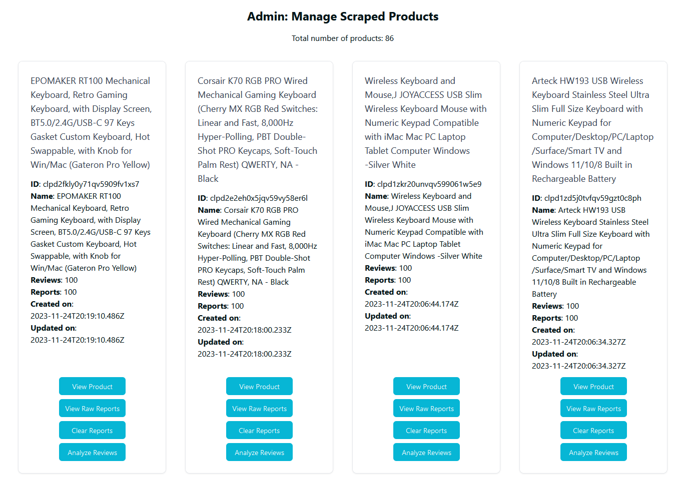

# Scraper Project

This project handles scraping reviews from external services such as Amazon, and analyzing these reviews for "product issues" that have been mentioned.

The scraper project is separate, and written in Python, to be able to utilize the improved Python library ecosystem for web scraping and analysis, as well as to allow all scraping to happen asynchronously in an independent process, or even on seperate machines.

## Initializing the environment

Setup instructions are described [here](../README.md#scraper).

## Testing the project

The project is tested using pytest.

To run the tests, run `pytest` in the scraper directory.

### Crawler Service

The first part of the scraper project is the crawler. The crawler crawls webpages for product links, and adds them to the scraping queue when found. The crawler is controlled through commands sent to RabbitMQ by the web server project.

The crawler works by scanning for links matching a specific pattern.

### Scraping Service

The scraper service listens to the to_parse queue, and when a new link is added to the queue, it will scrape the page for reviews, and add them to the to_analyze queue. These can be products collected by the scraper, or products manually added through the web server project.

The scraper starts by making requests to the product page using the curl-impersonate library to simulate a web-browser without the overhead of a real web-browser. It then forwards on to the proper parser (located in `./parser`) for the dedicated website. For example, Amazon pages use `./parser/amazon.py`.

The parser then iterates over each page of reviews, going to the next page when done. For each page, it iterates over each review and uses a css selector for each element it needs to extract. Each element is then placed in a class for storage.

It also records the product information, such as the name and manufacturer.

Once the product reviews have been scraped, it converts this data to JSON and sends it to the `to_analyze` queue in RabbitMQ.

### Analyzer Service

The analyzer service listens to the `to_analyze` queue and performs analysis on each review to determine if there are any product issues mentioned in the review.

This service is further explained in [it's dedicated documentation page](analyzer/README.md).

## Admin Operation

The scraper can be manually controlled from the admin interface. The web server, scraper, analyzer, database and RabbitMQ must be running for this to work. Setup for this is describe in [the main readme](../README.md)

To start a scrape of a specific product, go to the "Add to Queue" (`/admin/queue`) page. Enter the URL to the produce into the textbox and click "Add".

To view the results of the scraping and analysis, visit the Admin products page (`/admin/products`). This page will list recently scraped products, along with the reviews that were scraped, as well as the reports that were processed. This page also allows you to clear analyzed reports for a specific product, and trigger analysis for all reviews of a product.

